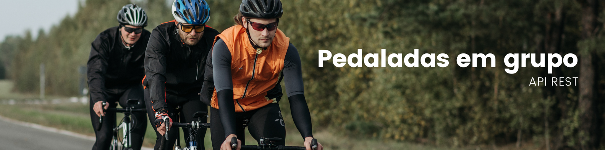

<!-- ME CONTRATA! -->

> 🔹 Projeto desenvolvido para práticar meus conhecimentos em Nest.js e Autenticação JWT

## Cenário
Imagine que você precise organizar um pedal, este de alguma forma será para um grande grupo de pessoas. A gestão desse evento em um bloco de papel ou planilha é limitador, com possibilidades de inconsistência nos dados e muitas vezes não atendedendo todos os seus requisitos do cenário.

## Proposta
A proposta dessa api é ser simples e eficaz, permitindo que usuários possam criar pedais, gerenciar datas de início e de fim dos cadastros, bem como a quantidade de participantes. O gestor de um pedal também será capaz de gerar convites para possíveis participantes.

Quem sabe esse projeto não desperte seu interesse em fazer alguns pedais com seus amigos?!

## Instalação

### Pré-requisitos

Antes de começar, você vai precisar ter instalado em sua máquina as seguintes ferramentas:
- [Git](https://git-scm.com) - Para clonar esse projeto, e quem sabe no futuro fazer um pull de alterações do mesmo.
- [Docker](https://www.docker.com/) - O projeto foi desenvolvido para ser servido por containers docker.

### Rodando a aplicação
- Para iniciar a aplicação, clone este repositório para a pasta que desejar:
  - ```git clone https://github.com/Casmei/pedaladas-em-grupo.git .```
- Em seguida rode a aplicação com o comando:
  - ```docker-compose up```

```md
  Atenção: Verifique se as postas 3000 e 5432 estão disponíveis em sua máquina
```
## Documentação
Foi utilizado o [Swagger](https://docs.nestjs.com/openapi/introduction) para documentar a aplicação, inicie o projeto e entre nesse [link](http://localhost:3000/docs) para acessar a documentação, ou, coloque ```/docs``` na rota raíz.

## Ferramentas utilizadas

- Nest.js
- TypeORM
- Postgress
- Docker

---

Feito com ❤️ e ☕ por Tiago de Castro 👋🏽 [Entre em contato!](https://earnest-begonia-690754.netlify.app/)

